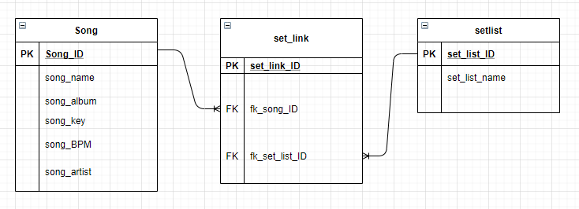
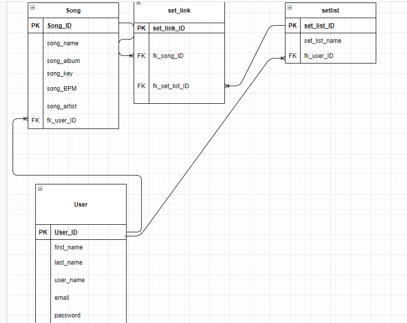
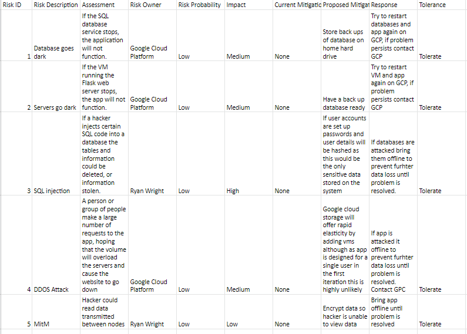
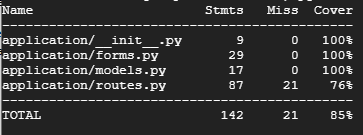
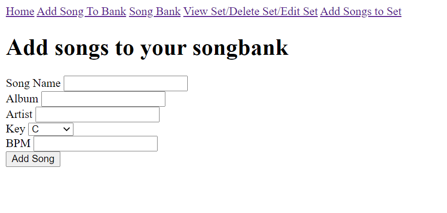
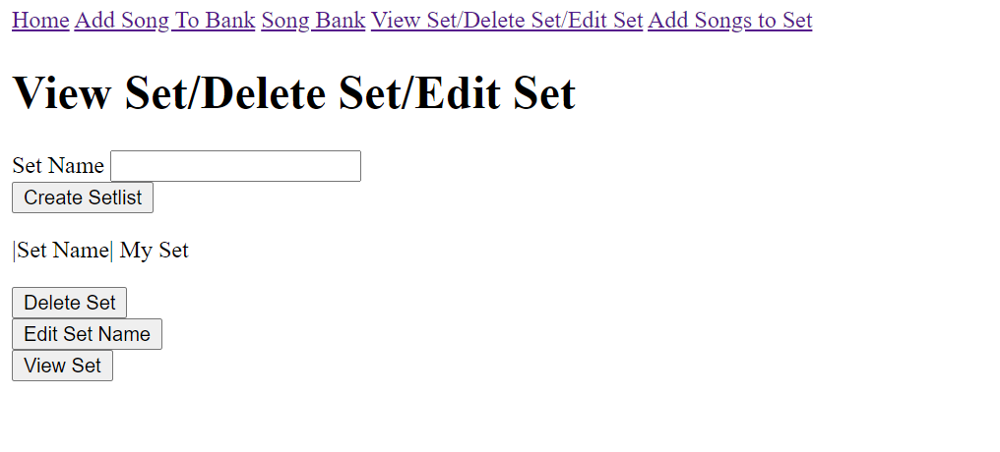
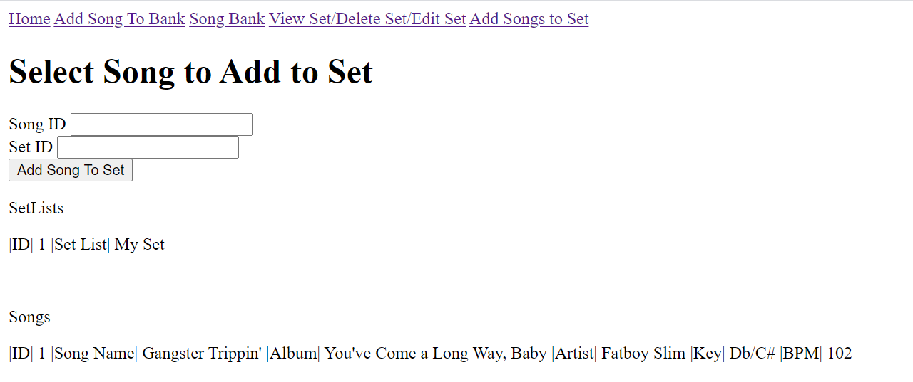

# SIFA PROJECT 1

# Set List App

### Resources
* Jira: https://ryanwright.atlassian.net/jira/software/projects/SLL/boards/3
* Website: http://34.89.9.75:5000/

### Brief

For our task we were set with the objective: ‘To create a CRUD application with utilisation of supporting tools, methodologies and technologies that encapsulate all core modules covered during training.’

### Additional Requirements

* Kanban board
* Relational database that needs to have at least 2 tables in it.
* Clear Documentation from a design phase describing the architecture and Risk Assessment.
* A functional CRUD application created in Python, following best practices and design principles
* Test suites for the application you are creating, as well as automated tests
* Functioning front-end website
* Code integrated into a Version Control System using the Feature-Branch model which will subsequently be built through a CI server and deployed to a cloud-based virtual machine.

## Table of Contents

1. [My Approach](#myapproach)
2. [Project Tracking](#projecttracking)
3. [Database Structure](#databasestructure)
4. [Risk Assessment](#riskassessment)
5. [Continious Integration Pipeline](#cipipeline)
6. [Testing](#testing)
7. [Front-End Design](#frontend)
8. [Known Issues](#knownissues)
9. [Future Improvements](#futureimprovements)

### My Approach 

To achieve our objective I decided my set list app must allow the user to do the following:

* Store song details in a set list(satisfies ‘Create’)
 * Song Title
 * Song Album
 * Song Artist
 * Song Key
 * Song BPM
* Allow for a song or set lists to be deleted (Satisfies ‘Delete’)
* Allow for set lists to be viewed (Satisfies ‘Read’)
* Allow for song or set list details to be updated (Satisfies ‘Update’)

## Project Tracking 

To manage my project I needed a project tracker, I decided on using Jira software to manage my project.

Using it allowed me to break my project down into smaller more manageable tasks. My next point was to define user stories which would allow me to implement MoSCoW prioritization.  I placed all my must have user stories in the must have user stories section while putting the could haves in the product back log.

For my project to be successful using agile methodologies I would build my first sprint around developing an app based around 1 user using the must have user stories. 

## Database Structure 

Below is an entity relationship diagram showing the structure of the database for the first iteration. 

This schema was achieved by using python code written out in my models file and used Flask SQLAlchemy to configure the application with the SQL instance, Google Cloud Provider (GCP) provided this database instance.

A link table had to be included for this schema to function due to the nature of the many to many relationship between the Songs and Set List table. This Table would turn this relationship from a many-to-many to two one to many relationships.

This database would satisfy the requirements of this project however I have included the ER diagram for when I wish to incorporate other users for later sprints.

I have included below an ERD for when I wish to add user log in to my project in future builds

## Risk Assessment 

The risk assessment can be found through the following link: https://docs.google.com/spreadsheets/d/1KQy9YNJtbZnqxqxCt1PdwelUX8IMVnbsUkg1c1bSYK4/edit?usp=sharing

## Continious Integration Pipeline 

Pictured above is my continuous integration pipeline. This will allow for a simple deployment of my application as when new code is pushed to git hub a Jenkins web hook installed on my Google Cloud Platform Ubuntnu VM with automatically build my application.

The webhook will initally run my unit tests and integration tests which are run from the repository using pytest. Providing the application passes these tests it will get built.

## Testing 

Pytest was used to run unit tests on the application. These tests were designed to test certain functionality on the application and would have an expaected result for each test run. My integration testing would be run by selenium and also triggered by pytest and run on chromium browser which is installed on my GPC VM. These tests would be run automatically by Jenkins anytime that new code is pushed to my github repository and would trigger another Jenkins build upon sucessful completion.

Pytest will also provide me with a coverage report which will let me know how much of the code has been tested sucessfully. I managed to get the coverage to 85% this could have been improved upon but due to time constraints I decieded this was enough for the requirements of the project. Please see my coverage report below.

## Front End Design 

The front end of this application is quite simple at this stage built by very simple html combined with Jinja2 logic to allow it to communicate with the back-end python files.

User is brought to this page when they try and access the application

User can then add songs to their song bank

Users can view their song bank and edit or delete songs from ther song bank here

Users can create a blank setlist then view the setlist, edit the set name and delete the set.

User can use this page to combine songs with their setlist then once the songs are added they can view the set on the previous screen

## Known Issues 

There are a few issues that are known in the apps current build:

* Due to time constraints with the project I was unable to get it fully integrated as a systemd service so when tests or new code are to be uploaded the old build will have to be aborted. This is not ideal but will be a future improvement for this project to be included in the next sprint.
* When the user uses the menu to add a song to a set they are not redirected to the view sets page. This could be seen as confusing by an end user now knowing a song has been added to a set

## Future Improvements 

The future improvements I would like to try with this project are as following:

* Including functionality which will allow songs to be arranged by bpm
* Including functionality which will allow songs to be matched by key
* Asthetic overhaul on front end presentation
* Allow for mulitple users with an account system
* Changing int input for drop down selection on the page which allows songs and set to be combined
* Implementing application as systemd service
* Higher test coverage

## Authors

Ryan Wright